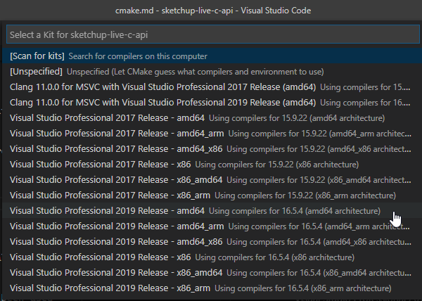
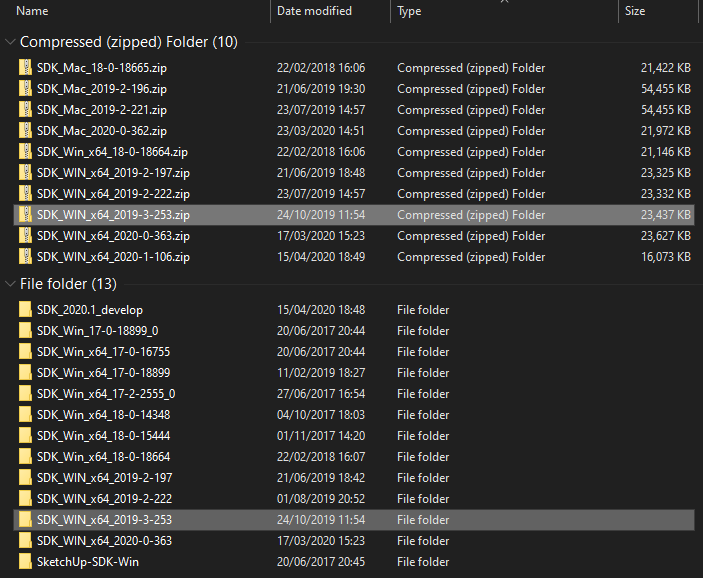
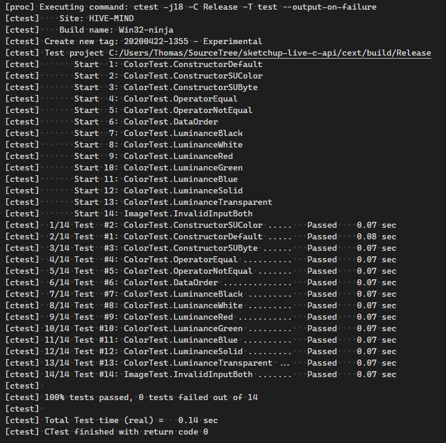
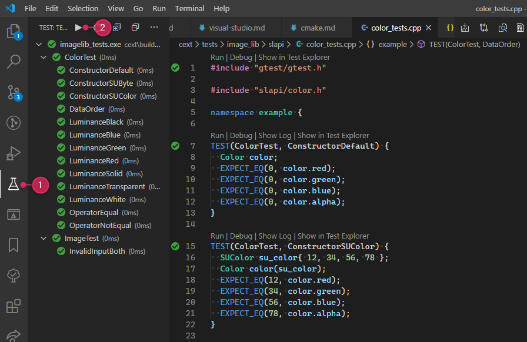
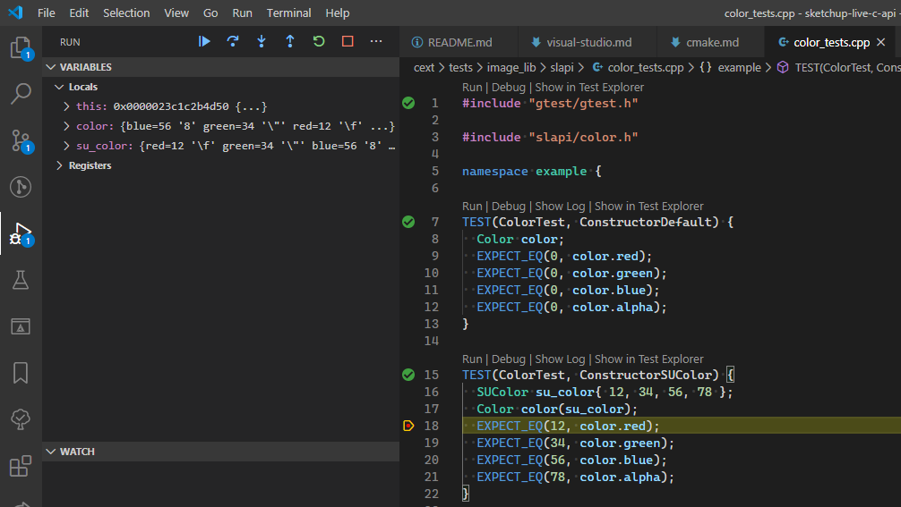
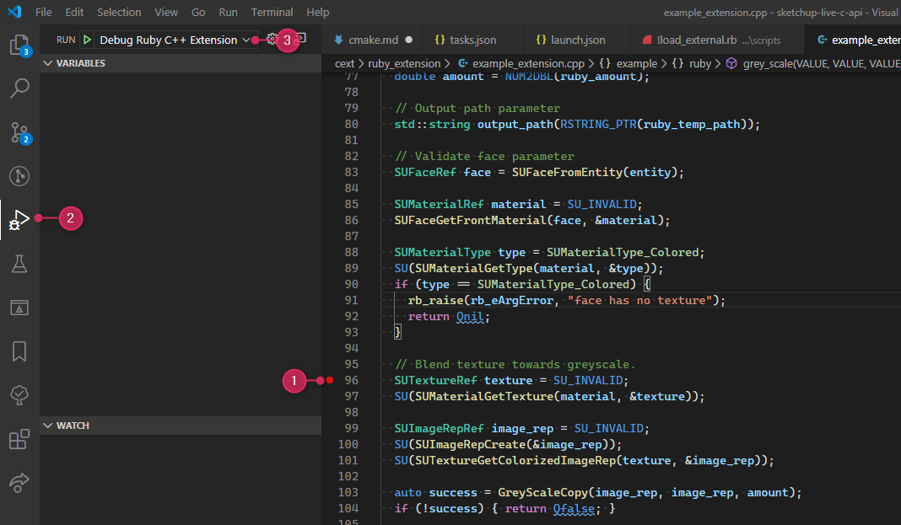
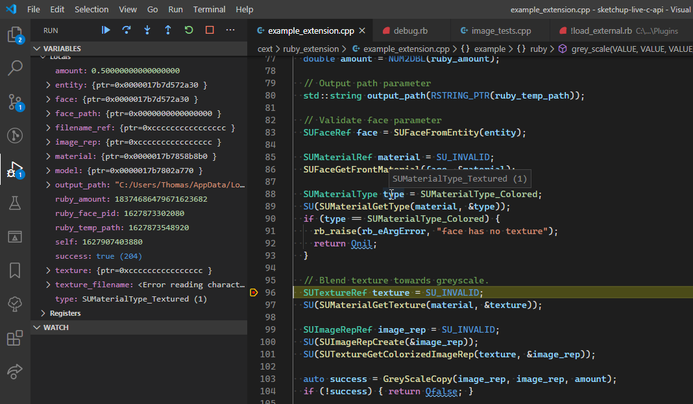
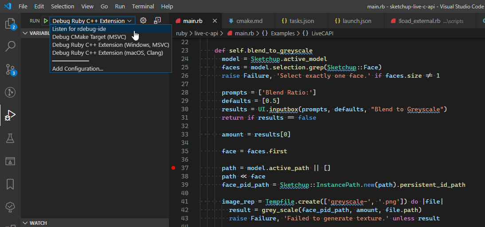
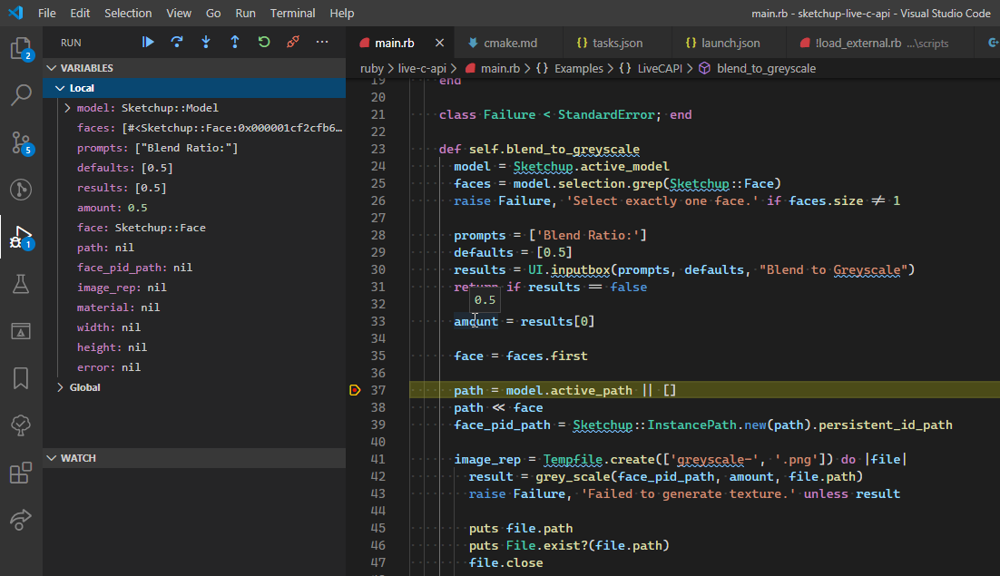

# CMake Example Project

The CMake example project for using the Live SketchUp C API is made to reasonable simulate a real world project.

It's not intended for beginners, familiarity with C++, compiling, Visual Studio, Xcode and CMake is expected.

The project is liberally commented around key aspects to inform about why things are set up the way they are.

## Requirements

It might be possible to use older versions for some of this, but it has not been tested.

The project has also mainly been tested as a Visual Studio Code project.

* CMake 3.17 or newer
* Visual Studio 2019
* XCode 10.3 (Clang 10)
* Ruby 2.3 or newer

*Remember to also checkout the git submodules!*

```sh
git submodule update --init
```

## Project Structure

```
Project Root
 ├─ cext
 │   ├─ build*
 │   │   ├─ Debug
 │   │   └─ Release
 │   ├─ image_lib
 │   ├─ ruby_extension
 │   ├─ scripts
 │   └─ tests
 ├─ cmake
 ├─ docs
 ├─ ruby
 └─ third-party
```

### `/cext`

This directory contains the source code for the Ruby C Extension.

#### `/cext/build`

The build directory is generated by CMake with subfolders for each configuration. It's set up such that you can quickly switch between build configurations without having to clear out the build directory.

#### `/cext/image_lib`

The main logic of the extension is in this static library containing only C/C++. This allows it to be consumed by the Ruby C Extension as well as tests.

#### `/cext/ruby_extension`

The Ruby C extension interface which consumes the static lib from `/cext/image_lib`. This layer is kept minimal, main purpose is to interface between Ruby and C/C++.

#### `/cext/scripts`

Scripts used for the build and debugging process.

#### `/cext/tests`

C/C++ tests consuming the `/cext/image_lib` static library. This allows for the main logic of the Ruby C Extension to be tested without having to launch SketchUp.

### `/cmake`

This directory contains a collection of CMake helper modules. They are meant to be somewhat reusable for other projects.

### `/ruby`

This directory contains the source code for the Ruby extension itself, it relies on the output of `/cext`.

### `/third-party`

This directory contains third party libraries and submodules the project depends on.

## Getting started with VSCode and CMake

Upon opening the project in VSCode the editor will prompt to install any necessary VSCode extensions that might be missing.

Once open, choose your CMake toolkit.



The following toolkits have been used while developing this example project:

* Visual Studio Professional 2019 Release - amd64
* Clang 10.0.1

## Configuration

The SketchUp C API is not included in this repository. It must be downloaded separately from the [Developer Portal](https://developer.sketchup.com/).

Download the ZIP file for your platform to a directory; for example `"C:/Users/<username>/SLAPI"`.

While unpacking, make sure the files are extracted to a directory that matches the base name of the ZIP.



Then add that path to the CMake environment variables with the key `SketchUpAPI_SEARCH_DIR`.

The project will look for an appropriate SDK package in the path given by `SketchUpAPI_SEARCH_DIR` using the name of the directories to determine what version they represent.

You can set up this variable from VSCode for convenience:

`<Command Palette>` » Preferences: Open Settings (JSON)

```json
{
  "cmake.environment": {
      "SketchUpAPI_SEARCH_DIR": "C:/Users/<username>/SLAPI"
  }
}
```

After that is set up you should be able to invoke a successful CMake configuration:

`<Command Palette>` » CMake: Configure

## Building

`<Command Palette>` » CMake: Build

## Running Tests

To run the tests you can invoke CTest and see the results in the VSCode Output panel.

`<Command Palette>` » CMake: Run Tests



Alternatively, the VSCode Test Runner extension can be used for easy granular control. It also provides easy access to debug or rerun specific tests.



## Debugging

Besides using the Test Runner in VSCode to run and debug tests, debugging of executables generated by the CMake project can be invoked via:

`<Command Palette>` » CMake: Debug

You might need to set the debug target first:

`<Command Palette>` » CMake: Set Debug Targets

The debugger should break on the break point set in the VSCode editor.



## Running/Debugging the Ruby Extension

### Setup

*Make sure to run `bundle install` to ensure all required gems are installed.*

To ease developing Ruby Extensions for SketchUp it's convenient to load it directly from the repository source. To do so you need a helper file in the regular SketchUp Plugins directory.

This project includes such a file that also aids in debugging the Ruby C Extension binaries from the build directory.

Copy the [`cext/scripts/!load_external.rb`](../cext/scripts/!load_external.rb) file to the Plugins directory of the SketchUp version you will be using.

Standard locations for SketchUp 2019 are:
* %APPDATA%\SketchUp\SketchUp 2019\SketchUp\Plugins
* ~/Library/Application Support/SketchUp 2019/SketchUp/Plugins

You get get the for your machine and SketchUp installation by typing
`Sketchup.find_support_file('Plugins')` into the Ruby Console.

After copying the file to your Plugins directory you need to update the path to point to where you have located the project:

```rb
paths = [
  '<TODO_PathToRepository>/sketchup-live-c-api/ruby',
]
```

### Running the Ruby Extension

If you launch SketchUp directly after setting up the `!load_external.rb` helper it will fail to load the Ruby C Extension unless you have copied it into the extension's Ruby source. Use CMake to install the binaries to `ruby/live-c-api/cext/`:

`<Command Palette>` » CMake: Install

### Debugging Ruby C-Extension

If you need to debug the Ruby C Extension while it runs inside of SketchUp the project is set up with two debug tasks for that purpose; one for each platform.

* Debug Ruby C++ Extension (Windows, MSVC)
* Debug Ruby C++ Extension (macOS, Clang)



That will prompt you for which SketchUp version to use and what Build configuration. (CMakeTools is currently unable to provide the current build configuration to `launch.json`).

Once SketchUp has launched invoke the extensions and you should see the debugger break on the breakpoints you have set in your Ruby C Extension code.



### Debugging Ruby Code

If you need to debug your Ruby code that is also possible. For more details about this, refer to the SketchUp Ruby Debugger project:

https://github.com/SketchUp/sketchup-ruby-debugger

*You need to install an additional debugger library for SketchUp in order for Ruby debugging to work.*

First you must launch SketchUp in a special Ruby debugging mode:

`<Command Palette>` » Tasks: Run Task » Launch SketchUp in Ruby Debug mode

This will prompt you for what version to use. To avoid being prompted repeatedly you can rerun the task and it will remember you last selections.

`<Command Palette>` » Tasks: Rerun Task

Once SketchUp has launched you can attach the Ruby debugger by using the "Listen for rdebug-ide" launch configuration:



You should then see the debugger breaking on breakpoints in your Ruby code:


