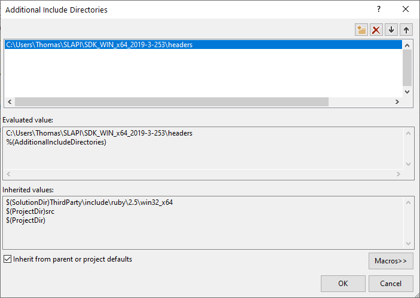
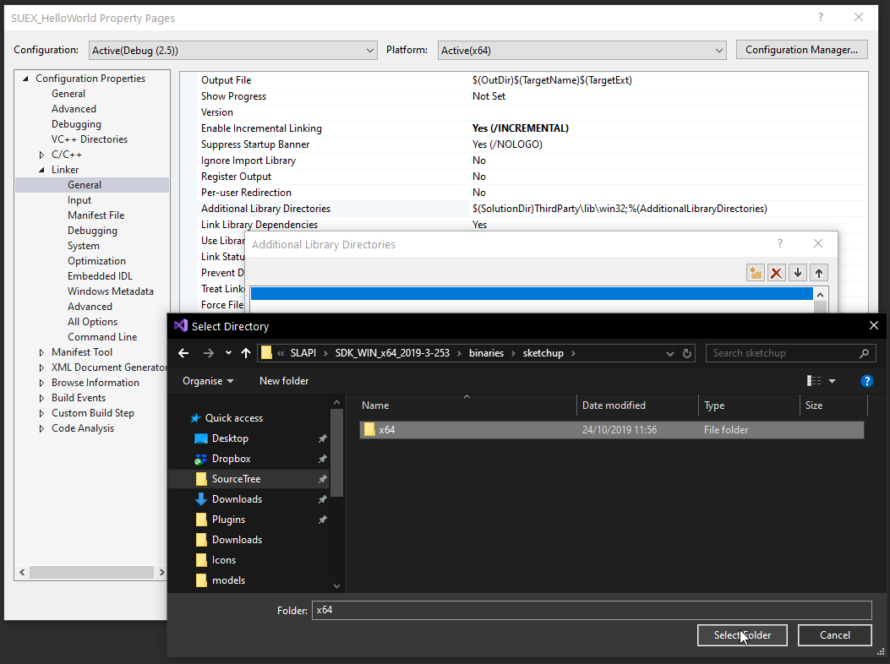
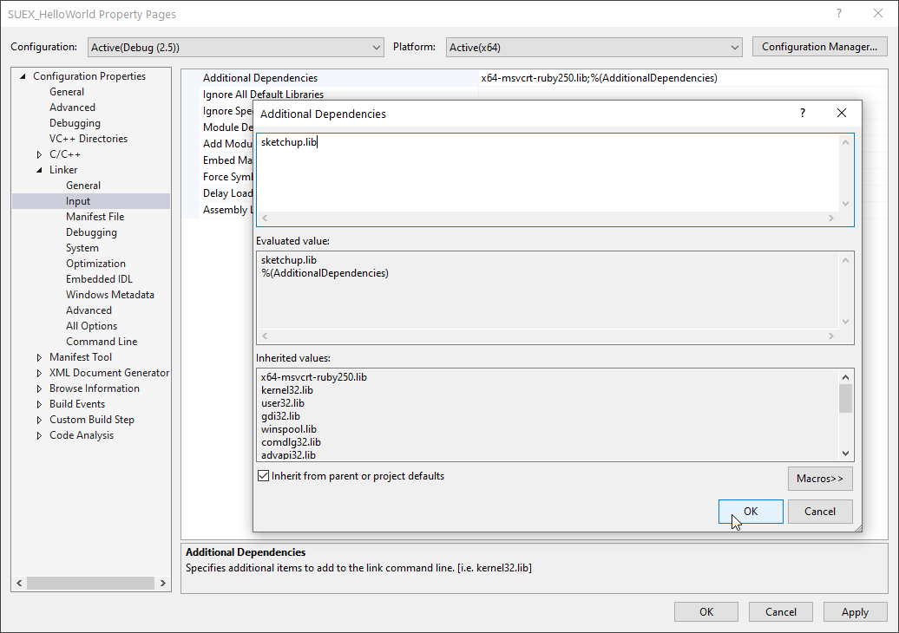

# Visual Studio

The base for this is a [Ruby C Extension](https://github.com/SketchUp/ruby-c-extension-examples).

* Open the `Properties Pages` for the project.

## Include Headers

* Add `<SDK_PATH>\headers` to `C/C++ / General / Additional Include Directories`

## Linking

**Important!** You *must* link against `sketchup.lib` when using the Live C API. If you link against `SketchUpAPI.lib` it might appear to work in many case, but it will at some point lead to crashes or invalid models.

Beware that if you use symbols introduced in a newer version on an older SketchUp version it will not work. Consider linking against the SDK binary matching the version of the oldest SketchUp version you support, that way you catch missing symbols during compile-time.

* Add `<SDK_PATH>\binaries\sketchup\x64` to `Linker / General / Additional Library Directories`.
* Add `sketchup.lib` to `Linker / Input / Additional Dependencies`.

## Next

* [Using the Live C API](using-live-c-api.md)
