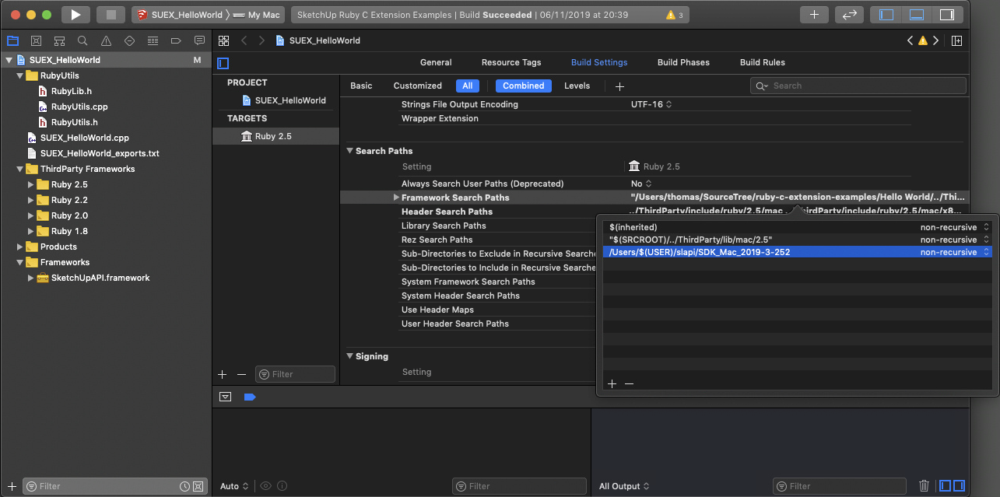
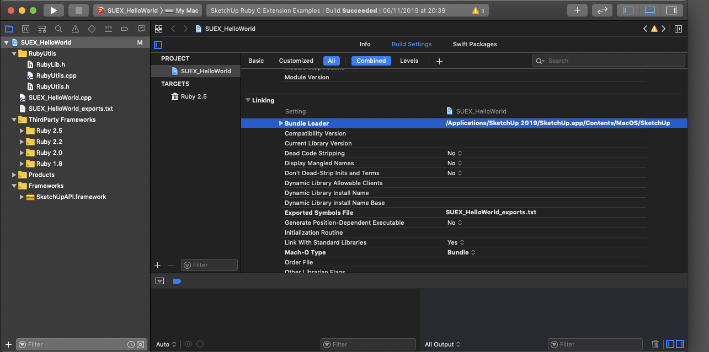

# Xcode

The base for this is a [Ruby C Extension](https://github.com/SketchUp/ruby-c-extension-examples).

## Include Headers

* Add `<SDK_PATH>` to `<TARGET> / Build Settings / Search Paths / Framework Search Paths`

## Linking

**Important!** Do *not* link against `SketchUpAPI.framework`.

When using the Live C API you must instead set the Bundle Loader to a version of SketchUp that contains the symbols you are using. You do not need to make a binary for every target SketchUp version. The Bundle Loader is only used during link-time.

Beware that if you use symbols introduced in a newer version on an older SketchUp version it will not work. Consider setting the Bundle Loader to the oldest SketchUp version you support, that way you catch missing symbols during compile-time.

If you link against `SketchUpAPI.framework` for Live C API it might appear to work, but will eventually cause crashes or corrupt models.

* Add `/Application/SketchUp 2019/SketchUp.app/Contents/MacOS/SketchUp` to `<PROJECT> / Build Settings / Linking / Bundle Loader`.

(Replace `SketchUp 2019` with whatever SketchUp version you have that include all the symbols you are using.)

## Next

* [Using the Live C API](using-live-c-api.md)

